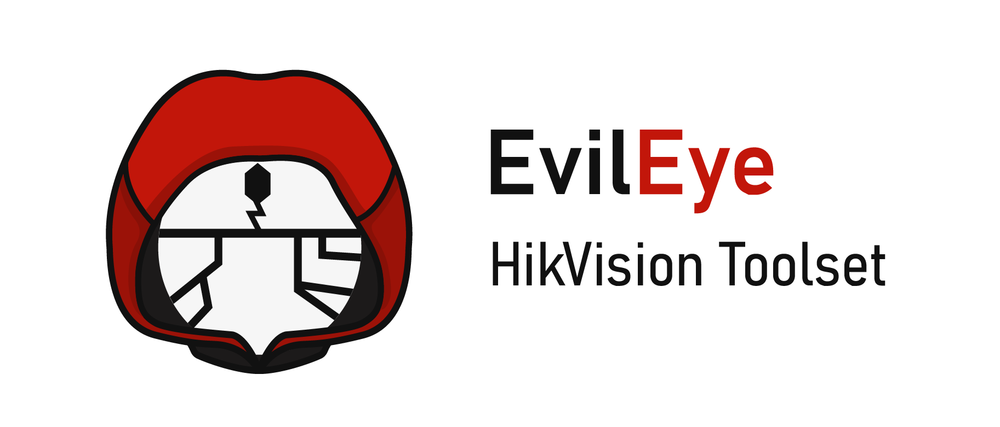

<p align="center">
  <br />
</p>

***

[](https://www.gnu.org/licenses/gpl-3.0)


**EvilEye** is a simple command-line password stuffing tool build using **Python** used for searching for vulnerable HikVision devices open to the internet.

> 📚 This project is still work in progress, use at own risk!

<br>


## 🍬 Features
The most noticeable features currently implemented in EvilEye:
- **Shodan Integration**, search for HikVision devices using your Shodan account.
- **Notion Integration**, Save, and collect found devices in your Notion tables.
- **Information Gatherer**, get basic information about the device, like users or connected cameras.

<br>


## 🎉 Getting Started

To use **EvilEye** clone this repository and install necessary requirements:
```bash
python -m pip install -r requirements.txt
```

To get information about single device, type:
```bash
python evileye.py get -p <PASSWORD> <127.0.0.1:80>
```
On successful authentification this should return:
```json
{  
"address": {"ip": "127.0.0.1", "link": "http://127.0.0.1:80/", "port": "80"},  
    "cameras": [  
        {"id": "1", "name": "Camera 1", "resolution": "Proxy"},  
        {"id": "2", "name": "Camera 2", "resolution": "Proxy"}  
    ],  
    "credentials": {"password": "<PASSWORD>", "username": "admin"},  
    "info": {"firmware": "V3.4.4", "model": "DS-9632NI-XT", "name": "Recorder"},  
    "users": [  
        {"id": "1", "level": "Administrator", "username": "admin"},  
        {"id": "2", "level": "Operator", "username": "security"}
    ],  
}
```
<br>

****_This project is for educational purposes only. Don't use it for illegal activities. I don't support nor condone illegal or unethical actions and I can't be held responsible for possible misuse of this software._****

<br>

## 🚧 Contributing

**You are more than welcome to help me build the EvilEye!**

Just fork this project from the `master` branch and submit a Pull Request (PR).

<br>

## 📃 License
This project is licensed under [GPL-3.0](https://choosealicense.com/licenses/gpl-3.0/) .
